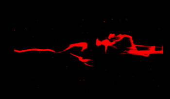
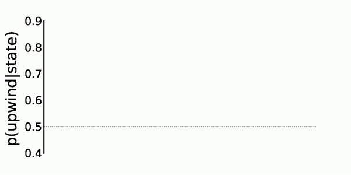

# Navigating Turbulent Odor Plumes Using Reinforcement Learning

This repository explores the use of traditional Reinforcement Learning *temporal-difference* methods such as the  [Q-learning](https://en.wikipedia.org/wiki/Q-learning) algorithm to understand how agents can learn to navigate to the source of a 2D turbulent odor plume. Turbulent odor plumes are spatiotemporally complex: odor signals arrive in random, unpredictable bursts, and odor concentration does follow continuous gradients, making plume navigation a difficult task. Surprisingly, there has been no published work on applying RL algorithms to turbulent odor plume navigation. 

As an example, below is a snippet of the trajectories produced during a Q-learning task on the odor plume shown above. In this RL task, agents have access to 2 **actions**, which occur stochastically at random times: turn at a normally distributed angle $\sim \mathcal N(30^0, 10^o)$ in either the a) upwind direction or b) downwind direction. Agents make these actions in one of 3 **states**, which are defined by the frequency of hits -- low, medium or high -- they make with the plume. 

Over the course of this RL task, the agents learn to find the source in the middle left of the arena:

And here is the progression of the softmax probabilities for the upwind action for each of the 3 states, $p(\text{action}=\text{upwind}|\text{state = \{low, med, high\}})$ during this learning process. Q-learning determines that higher frequency states (dark blue) should turn upwind with higher likelihood ($p\sim0.8$ than low or medium frequency states (lighter blue shades). Low frequency states in particular should opt for a slight downwind ($p < 0.5$) bias.

Explore the algorithms in the Jupyter Notebooks in the main directory. 

